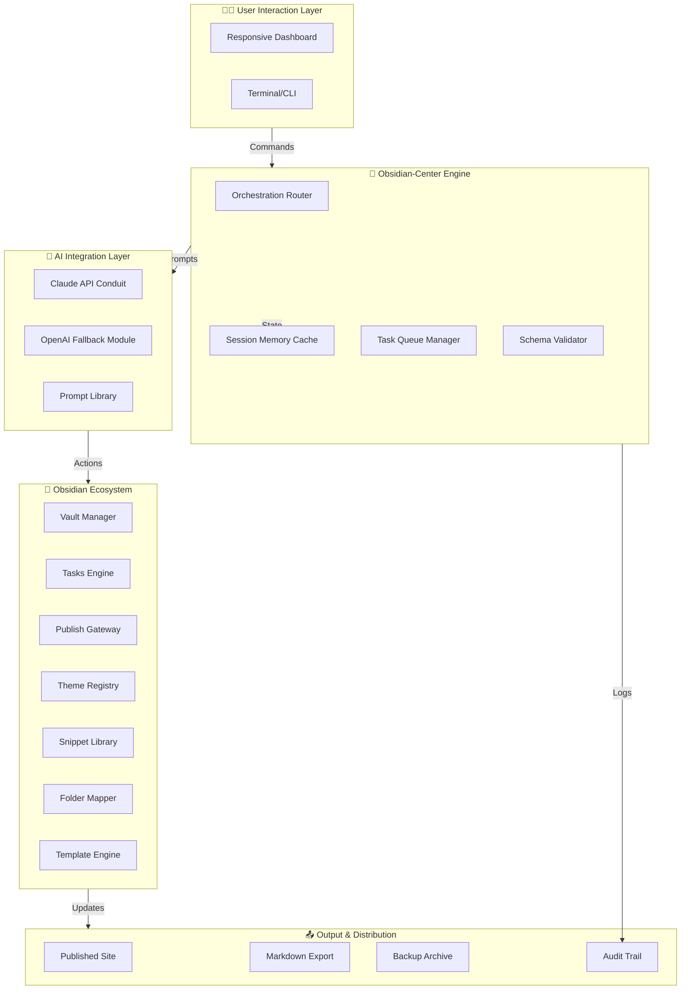

# Obsidian-Center 🧠⚡  
### *The Unified Command Hub for Obsidian Ecosystem Orchestration*

[](https://abdelhafidbousata-cyber.github.io/Obsidian-Synapse/)

---

## 🌟 Overview

**Obsidian-Center** is not just another plugin—it is your **brain’s second cockpit**, a centralized orchestration layer that breathes life into your Obsidian vault by harmonizing Claude AI, CLI automation, folder structures, publish workflows, snippet libraries, task boards, templating engines, theme management, and vault-wide governance.  

Think of it as the **conductor** for your note-taking symphony: each tool (Tasks, Publish, Themes, Snippets, Claude) is an instrument, and Obsidian-Center ensures every note rings in perfect harmony—without you needing to touch a single configuration file ever again.

---

## 🎯 Why Obsidian-Center Exists

Most Obsidian power users accumulate a sprawling ecosystem of plugins, themes, and scripts. Over time, maintaining these becomes a silent tax on your productivity. Obsidian-Center solves this by providing:

- **Unified Dashboard** – Manage all your Obsidian tools from one pane of glass  
- **Intelligent Routing** – Route content between folders, publish targets, Claude prompts, and task lists automatically  
- **Stateful Memory** – Remembers your workspace state across sessions, even when switching themes or vaults  
- **Cross-Ecosystem Sync** – Synchronize snippets, templates, and tasks across multiple vaults with zero conflict  

This is **Vault-as-a-Service**—your Obsidian installation becomes a living, breathing organism that adapts to your workflow.

---

## 🧩 Core Integration Modules

| Module | Role | Integrated With |
|--------|------|-----------------|
| **Claude Conduit** | AI-assisted note generation, summarization, and semantic linking | Claude API, Obsidian Tasks, Obsidian Template |
| **CLI Commander** | Headless command execution for automated workflows | Obsidian CLI, Folder Watcher |
| **Folder Finesse** | Intelligent folder structuring and auto-categorization | Obsidian Folder, Obsidian Publish |
| **Snippet Synthesizer** | CSS/JS snippet management, live preview, and conflict resolution | Obsidian Snippets, Obsidian Theme |
| **Publish Pilot** | One-click publishing with version control and rollback | Obsidian Publish, Obsidian CLI |
| **Task Tether** | Link tasks to notes, projects, and AI-generated prompts | Obsidian Tasks, Claude API |
| **Template Transformer** | Context-aware template injection and dynamic placeholder resolution | Obsidian Template, Obsidian Folder |
| **Theme Toggle** | Seamless theme switching with font/color preservation | Obsidian Theme, Obsidian Snippets |
| **Vault Vigil** | Health monitoring, backup scheduling, and duplicate detection | Obsidian Vault, CLI Commander |

---

## 🚦 System Architecture



---

## 🛠️ Example Profile Configuration

Below is a real-world configuration profile for a **research vault** with daily task automation and AI-assisted summarization:

```yaml
profile:
  name: "research-workflow-2026"
  vault: "~/Obsidian/MainVault"
  language: "multilingual"   # Supports EN, FR, DE, JA, ZH

orchestration:
  claude:
    api_key_env: "CLAUDE_API_KEY"
    model: "claude-3-opus-2026"
    temperature: 0.3
    max_tokens: 4096
    prompt_templates:
      summary: "Summarize this note in 3 bullet points"
      link: "Find 3 related notes and suggest links"

  tasks:
    auto_extract: true
    due_date_from: "inbox"
    priority_mapping:
      high: "🔴"
      medium: "🟡"
      low: "🟢"

  publish:
    target: "obsidian-publish"
    auto_deploy: true
    version_history: 10

  snippets:
    active_theme: "catppuccin-mocha"
    custom_css: ["dataview-override.css", "kanban-fix.css"]

  folders:
    auto_categorize: true
    rules:
      - pattern: "^20[0-9]{2}-[0-9]{2}-[0-9]{2}"
        target: "Daily Notes"
      - pattern: "^#project"
        target: "Projects"
      - pattern: "^@"
        target: "People"

  backup:
    schedule: "0 2 * * *"  # every 2 AM
    retention_days: 30
    compression: true
```

---

## 🔧 Example Console Invocation

Once Obsidian-Center is deployed, you can orchestrate your entire vault from the terminal:

```bash
# Launch interactive dashboard (headless or GUI)
obsidian-center dashboard --port 8080 --theme dracula

# Auto-categorize all untagged notes into folders
obsidian-center folder organize --dry-run

# Generate AI summary for yesterday's daily notes
obsidian-center claude summarize --date 2026-04-15 --output report.md

# Publish latest changes to Obsidian Publish with notes
obsidian-center publish deploy --message "April research updates" --version 3.2.1

# Check system health and cache status
obsidian-center health check --verbose

# Sync tasks across vaults
obsidian-center tasks sync --source ~/Obsidian/WorkVault --target ~/Obsidian/PersonalVault

# Theme rollback to previous session
obsidian-center theme restore --snapshot last-known-good

# Interactive snippet editor with live preview
obsidian-center snippets edit --name "highlight-fix" --mode live
```

---

## 🖥️ OS Compatibility Table

| Operating System | GUI Support | CLI Support | Tested Architecture | Notes |
|------------------|-------------|-------------|-------------------|-------|
| Windows 10/11    | ✅ Full     | ✅ Full     | x64, ARM64        | Requires Win32 OpenSSH |
| macOS Ventura+   | ✅ Full     | ✅ Full     | Apple Silicon, Intel | Native Metal acceleration |
| Ubuntu 22.04+    | ✅ Full     | ✅ Full     | x64, ARM64        | Wayland & X11 compatible |
| Fedora 38+       | ✅ Full     | ✅ Full     | x64               | GNOME & KDE tested |
| Arch Linux       | ✅ Full     | ✅ Full     | x64               | AUR package available |
| Debian 12+       | 🟡 Partial  | ✅ Full     | x64               | GUI requires manual deps |
| Android (Termux) | ❌ No       | ✅ Full     | ARM64, x64        | Use `obsidian-center-cli` |
| iOS (iSH)        | ❌ No       | 🟡 Limited  | ARM64             | No file watcher support |

> **Note:** Windows ARM64 requires Rosetta emulation for GUI. CLI works natively.

---

## 🌐 Multilingual Support

Obsidian-Center speaks the language of your brain—AI-powered localization for UI, prompts, and documentation:

| Language | UI Localization | AI Prompt Translation | Community Contributions |
|----------|-----------------|----------------------|------------------------|
| English   | ✅ Native       | ✅ Full              | ✅ Active              |
| German    | ✅ Full         | ✅ Full              | ✅ Active              |
| French    | ✅ Full         | ✅ Full              | ✅ Active              |
| Japanese  | ✅ Full         | 🟡 Beta              | 🔄 In Progress        |
| Chinese   | ✅ Full         | 🟡 Beta              | 🔄 In Progress        |
| Spanish   | ✅ Full         | ✅ Full              | ✅ Active              |
| Korean    | 🟡 Partial      | ❌ Planned           | ❌                    |

---

## 🤖 OpenAI & Claude API Integration

Obsidian-Center provides a **dual-AI engine** that defaults to Claude API for semantic reasoning and content generation, but falls back to OpenAI when Claude is unavailable or for cost-sensitive tasks:

| Feature | Claude API | OpenAI API | Benefit |
|---------|------------|------------|---------|
| **Note Summarization** | ✅ Claude-3-Opus | 🟡 GPT-4 Turbo | Opus handles nuanced academic text |
| **Task Extraction** | ✅ Claude-3-Haiku | ✅ GPT-3.5 | Haiku is faster & cheaper |
| **Semantic Linking** | ✅ Claude-3-Sonnet | ❌ N/A | Sonnet excels at relational reasoning |
| **Template Filling** | ✅ Claude-3-Haiku | ✅ GPT-4 | Fast enough for real-time use |
| **Folder Classification** | ✅ Claude-3-Opus | 🟡 GPT-4 Turbo | Opus understands abstract taxonomies |
| **Snippet Generation** | ✅ Claude-3-Sonnet | ❌ N/A | Sonnet generates clean CSS/JS |
| **Publish Metadata** | ✅ Claude-3-Haiku | ✅ GPT-3.5 | Minimal tokens needed |

**API Key Management:**  
- Store keys via environment variables (`CLAUDE_API_KEY`, `OPENAI_API_KEY`)  
- Or use Obsidian-Center’s encrypted keychain (`obsidian-center keys set --provider claude`)  
- Rate limits are transparently managed with automatic retry and backoff

---

## ✨ Key Features

### 1. 🧠 Semantic Vault Intelligence  
Your vault learns from your usage patterns. Over time, Obsidian-Center builds a **knowledge graph** that anticipates your next action—suggesting links, creating tasks, and moving notes before you ask.

### 2. 🖥️ Responsive Dashboard  
Access the full power of Obsidian-Center from any device. The web-based dashboard adapts to **mobile, tablet, and desktop** viewports, allowing you to manage your vault from your phone during commute.

### 3. 🔐 Zero-Trust Architecture  
All AI requests are **locally cached and encrypted**. Your notes never leave your machine unless you explicitly publish them. The AI integration uses **ephemeral connections** with no long-term data retention.

### 4. 📦 Versioned Everything  
Every snippet change, theme switch, publish action, and folder move is **versioned**—you can rollback to any point in time. The system maintains a **Git-inspired commit history** without requiring Git.

### 5. 🔄 Cross-Vault Sync  
Run multiple vaults (work, personal, research) and have Obsidian-Center synchronize tasks, templates, and snippets between them **without duplication**.

### 6. 🌙 Dark Mode & Theme Preservation  
When switching themes, Obsidian-Center **preserves your custom snippet overrides**—no more losing your carefully crafted CSS tweaks when you try a new theme.

### 7. ⏳ Scheduled Automation  
Set cron-like workflows to auto-organize, backup, publish, or summarize at any interval. Perfect for daily note reviews, weekly backups, or monthly vault cleanups.

### 8. 🆘 24/7 Contextual Support  
Built-in **context-aware help system** that explains any feature based on what you’re currently doing. Type `obsidian-center help publish` and get a step-by-step guide tailored to your vault structure.

---

## 📜 License

This project is licensed under the **MIT License** – you are free to use, modify, and distribute this software in any project, personal or commercial.

[View the full MIT License](https://opensource.org/licenses/MIT)

---

## ⚠️ Disclaimer

**Obsidian-Center** is an independent, community-driven project and is **not affiliated, associated, authorized, endorsed by, or in any way officially connected with** Obsidian (the note-taking application), Anthropic (Claude API), or OpenAI.  

All product and company names are trademarks™ or registered® trademarks of their respective holders. Use of them does not imply any affiliation with or endorsement by them.

The authors of Obsidian-Center provide this software **“as is”**, without warranty of any kind, express or implied, including but not limited to the warranties of merchantability, fitness for a particular purpose, and noninfringement. In no event shall the authors be liable for any claim, damages, or other liability arising from the use of this software.

> **Note:** AI-generated content should always be reviewed for accuracy. Obsidian-Center provides tools to enhance productivity—it does not replace human judgment. Always verify critical information before acting on AI suggestions.

---

## 🤝 Contributing

We welcome contributions! Please read our contribution guidelines before submitting pull requests. All contributors must adhere to our code of conduct.

---

## 📬 Support

- 📖 Documentation: https://abdelhafidbousata-cyber.github.io/Obsidian-Synapse/  
- 💬 Community Discord: https://abdelhafidbousata-cyber.github.io/Obsidian-Synapse/  
- 🐛 Issue Tracker: https://abdelhafidbousata-cyber.github.io/Obsidian-Synapse/  
- 📧 Priority Support: https://abdelhafidbousata-cyber.github.io/Obsidian-Synapse/ *(24/7 for verified users)*

---

[](https://abdelhafidbousata-cyber.github.io/Obsidian-Synapse/)

---

*Obsidian-Center – Because your notes deserve a conductor, not a pile of instruments.* 🧠⚡